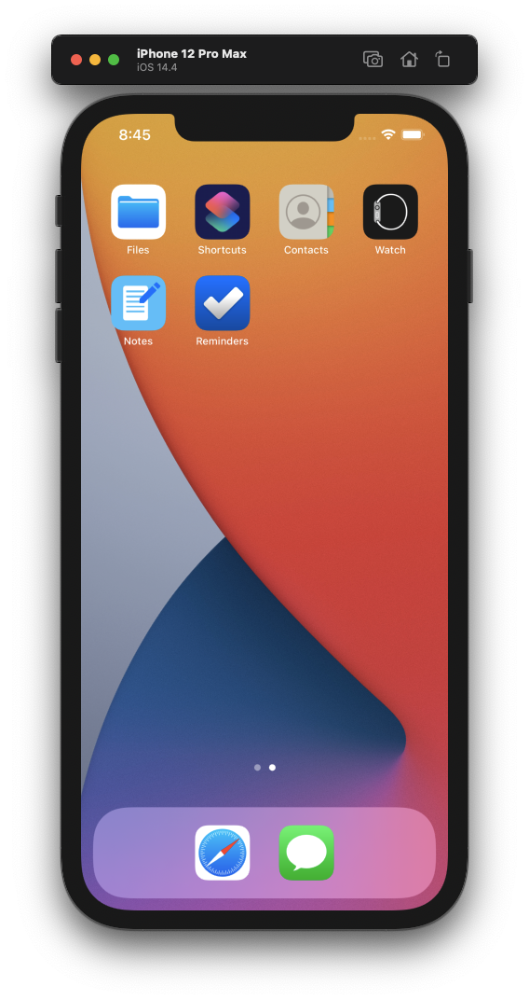
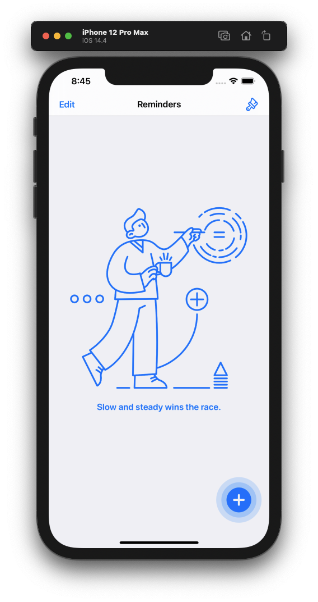
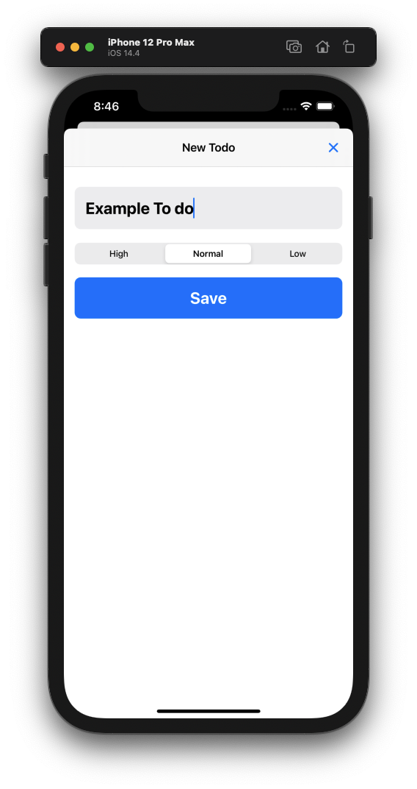
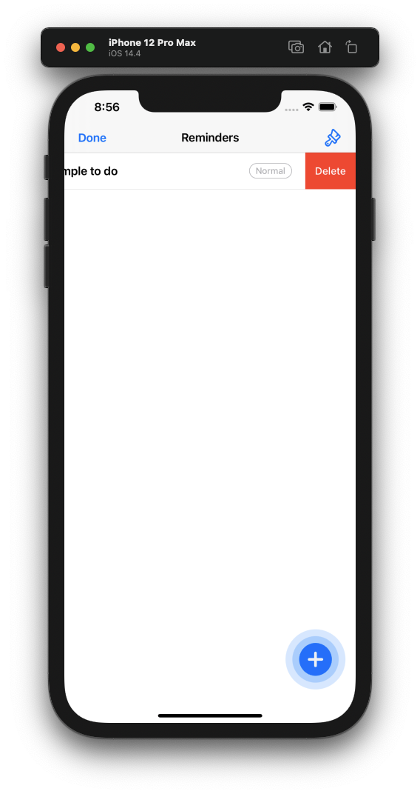
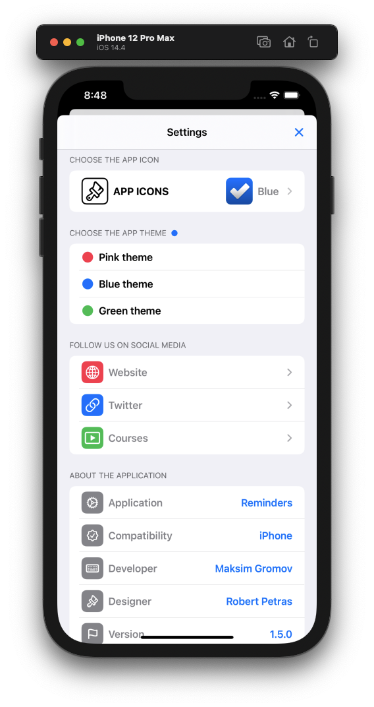
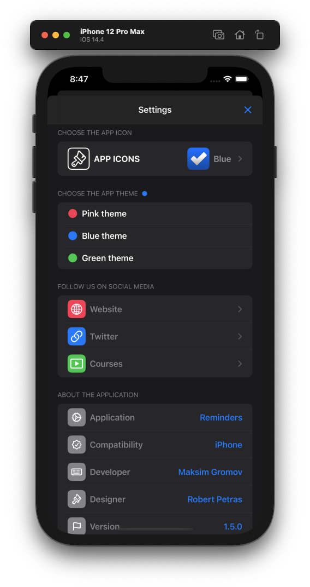
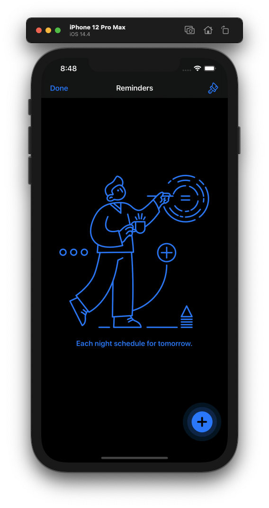
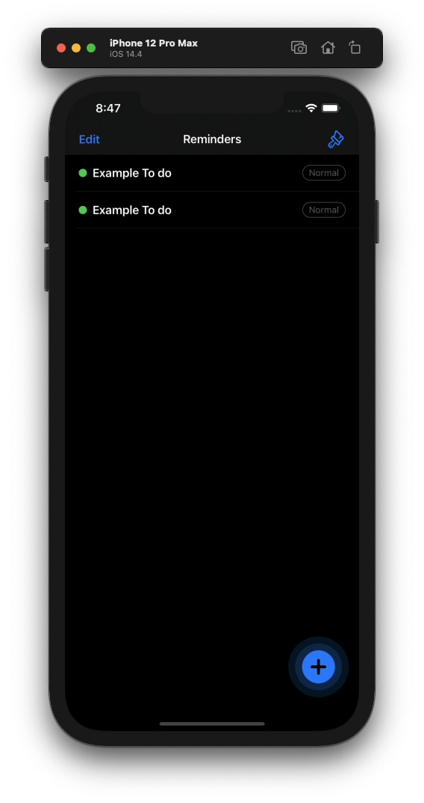

#  Reminders

>This is udemy learning project. Simple Todo app using CoreData and SwiftUI.  You can create, delete, update todos, change app icon  or app style. App is  fully finctional in light and dark mode.

